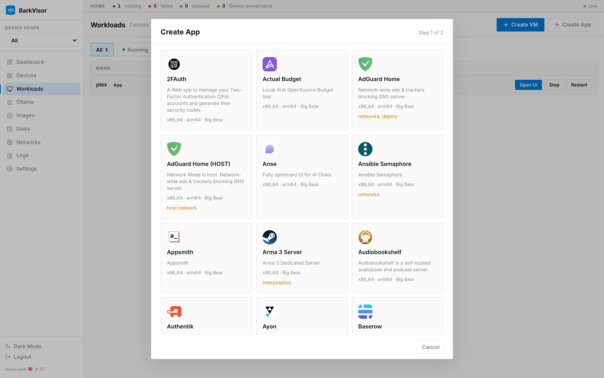
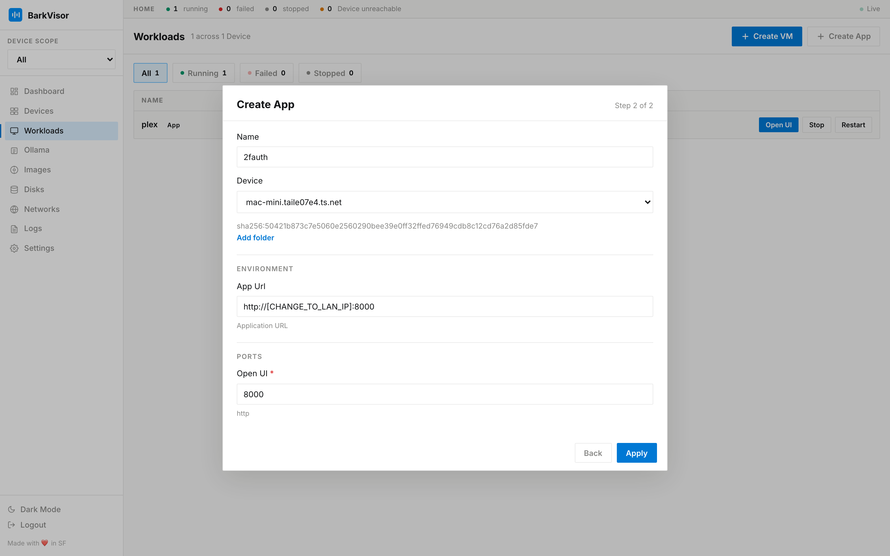
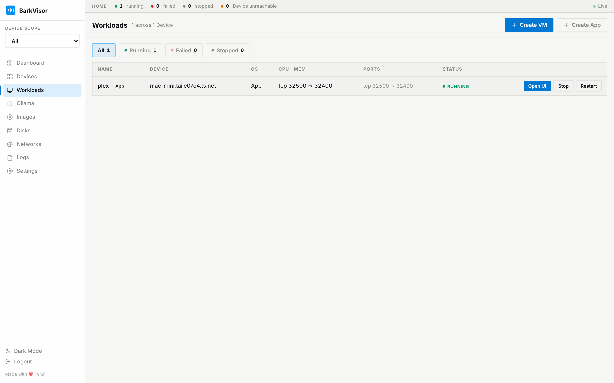
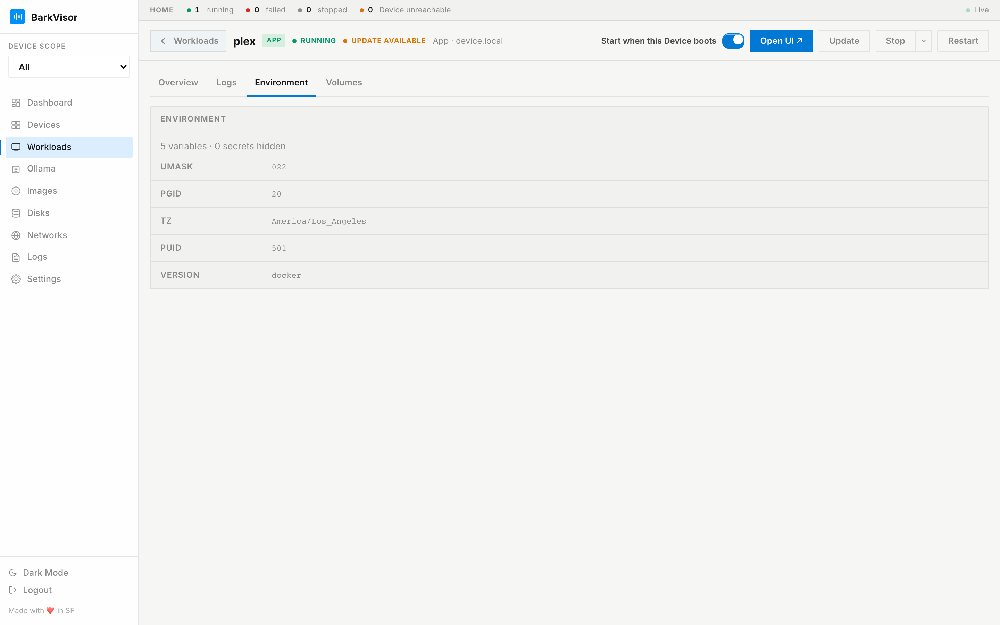
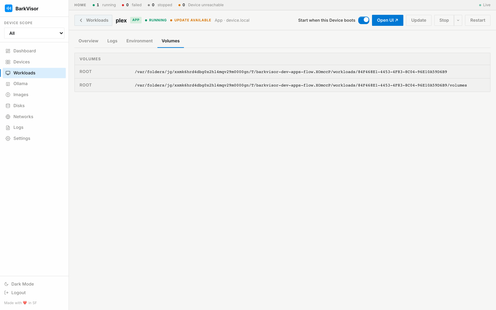

# Create App flow

Workloads → Create App → Configure → running Plex → detail tabs. Captured on a throwaway instance. LinuxServer Plex.

## Gallery

Workloads toolbar → **Create App**.

## Configure

Template fields for Plex.

## Workloads list

Plex running.

## Detail · Overview

Status, Access (LAN Open UI), Storage, Environment.

## Detail · Logs

Compose stream.

## Detail · Environment

Values shown; secrets redacted.

## Detail · Volumes

Bind and named-volume mounts.

