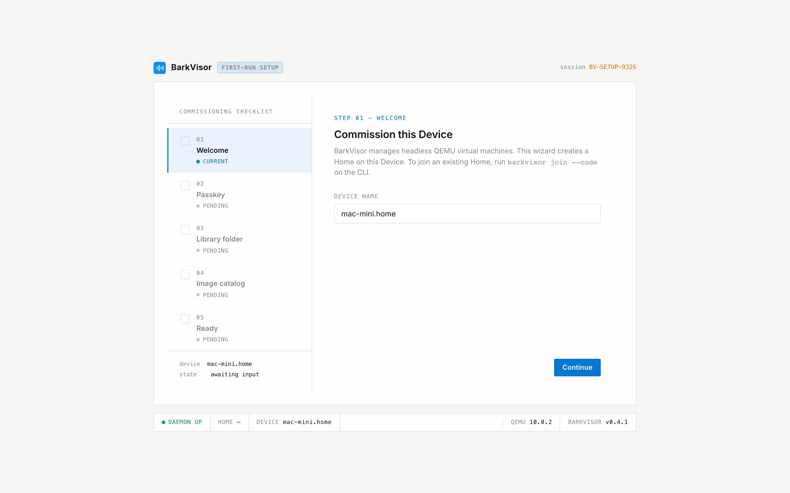
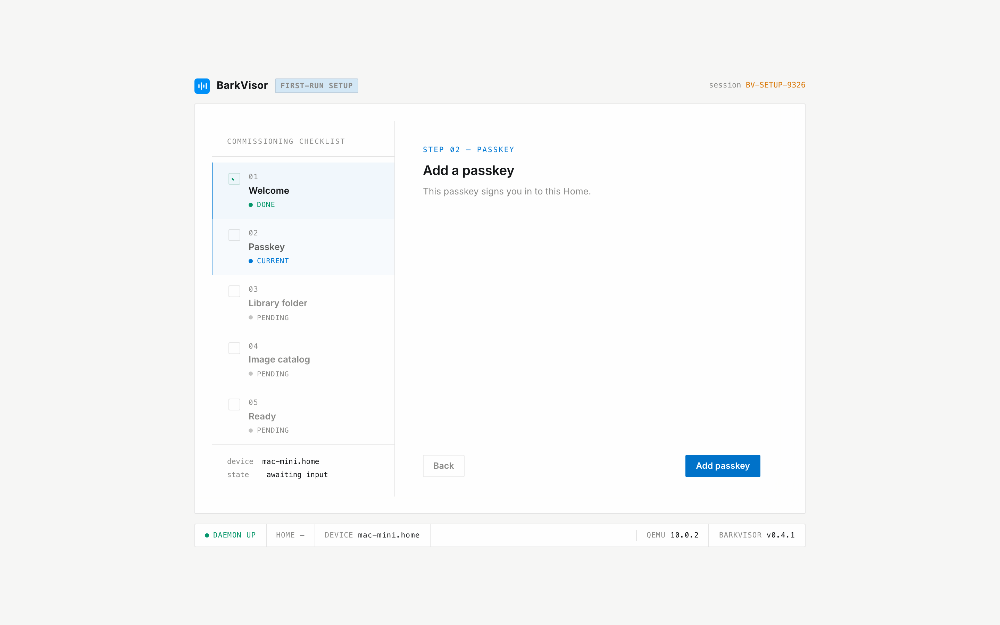
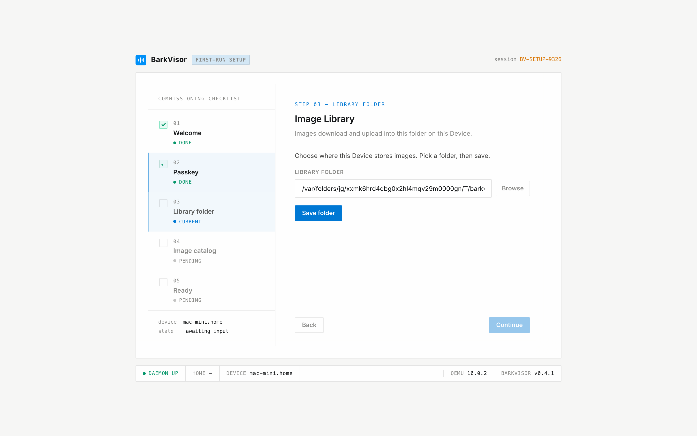
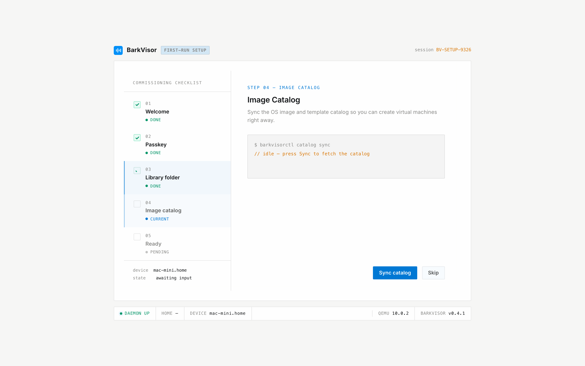
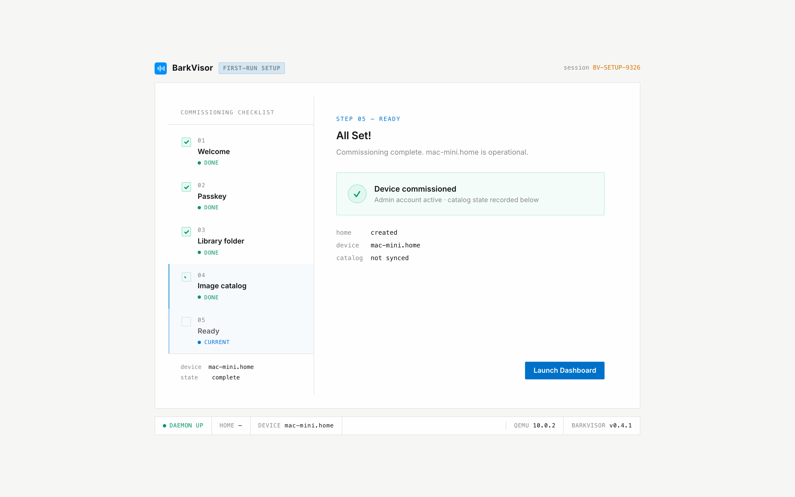
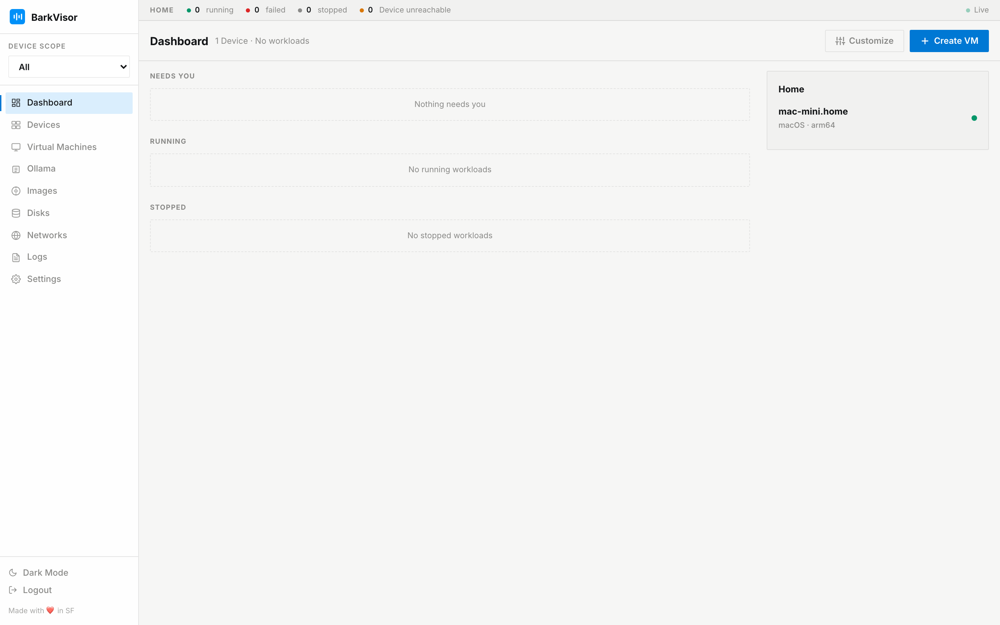

# First Launch and Setup

## What happens at startup

When BarkVisor starts for the first time, it prepares its data directory, creates everything it needs (including a **Default NAT** network so VMs get internet with zero configuration, plus the official image and template catalogs), and starts the web console on port **7777**.

## Web-based setup

Open `http://localhost:7777` in your browser. Use **localhost** (or https + a DNS name), not a raw IP — passkeys reject `127.0.0.1`. Since no admin exists yet, a setup wizard walks you through five short steps.

### 1. Welcome



Confirm the **Device name** and click **Continue**. This creates a new Home on this machine. To add this Device to an existing Home instead, join from the command line on this host (see [Home and pairing](home-and-pairing.md)) — this Device keeps running even if the other Device later goes offline.

### 2. Add a passkey



Click **Add passkey** and confirm with Touch ID, Windows Hello, or your password manager. There is no username or password — the passkey signs you in from now on.

If setup was interrupted earlier and you want a clean start, stop the daemon, delete the data directory, and start again.

### 3. Image Library folder



Pick where this Device stores OS images (**Browse**, pick a folder, **Save folder**, **Continue**). You can change this later under **Settings → Library**.

### 4. Image catalog



Click **Sync catalog** so OS images and templates are available immediately — or **Skip** and sync later from **Settings → Repositories**.

### 5. Ready



Click **Launch Dashboard**. BarkVisor signs you in automatically and opens the main UI (shown here: [Dashboard](using-dashboard.md)).



## Words we use

This Device is already a **Home** of one. Later, more Devices join that Home — not a cluster, datacenter, or quorum. See [Home and pairing](home-and-pairing.md) and [Product terminology](product-terminology.md). What shipped is in the [Changelog](changelog.md).

## After Setup

Once setup is complete, BarkVisor runs as a **headless daemon** serving the web UI on port 7777. There is no native desktop UI — all management happens through the browser (macOS and Linux).

On subsequent launches, the server detects the existing admin and starts normally without showing the setup screen (you land on **Login** instead). Sign in with **Sign in with passkey**. Add more under **Settings → Passkeys**.

## Bridged networking (optional)

NAT works out of the box on every host. For bridged networking:

### macOS

Install **socket_vmnet** with Homebrew as your user (`brew install socket_vmnet` — never with `sudo`). The BarkVisor daemon starts it for you. NAT Workloads work without this.

### Linux

Open **Networks → Host interfaces → Create → Bridge** and Apply. See [Installation (Linux)](getting-started-linux.md#bridged-networking) and [Networks](using-networks.md).

## Catalog Sync

Image and template catalogs from built-in repositories are synced automatically in the background on each startup. You can also trigger a manual sync from **Settings → Repositories**, or add custom catalog URLs there.

## Shutdown behavior

If you stop the daemon while VMs are running, the VMs keep running in the background — BarkVisor reconnects to them on next launch. To stop everything, stop your VMs in the web UI first.

To stop the daemon itself:

```sh
# macOS
sudo launchctl bootout system/dev.barkvisor

# Linux
sudo systemctl stop barkvisor.service
```
