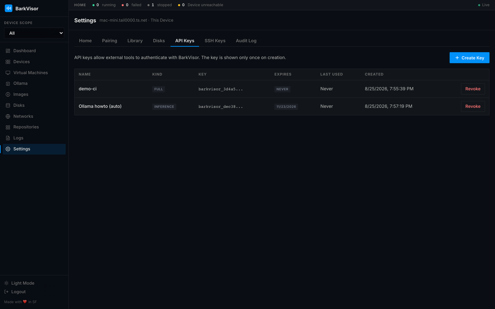

# Settings: API Keys

The **API Keys** tab issues credentials for scripts and API clients — including inference clients talking to Ollama. This is the default tab when you open Settings.

## Create a key

1. Click create. The modal asks for:
   - Name
   - Expiry: 30 days, 90 days, 1 year, or Never
   - Kind: **inference** (Ollama/completions only) or **full** (whole Home API)
2. Submit and the secret is shown **once**. Copy it immediately — there is no second look.
3. The key then appears in the table, masked, ready to **Revoke**.

Point clients at `http://<device>:7777/v1` with the key as bearer token; the [Ollama page](using-ollama.md) mints exactly this kind of key inline.

## Revoking

Revoke takes effect immediately. Anything still using the key starts failing auth.

## Related

- [Settings: SSH Keys](settings-ssh-keys.md) — guest access, different mechanism
- [Ollama](using-ollama.md)
