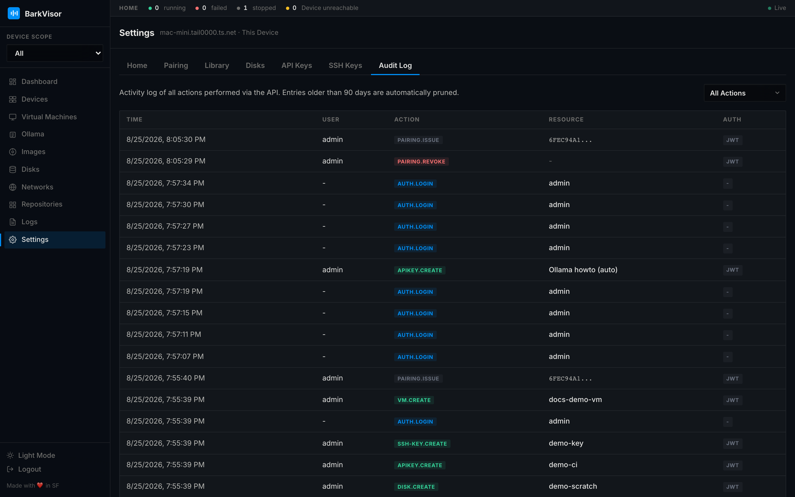

# Settings: Audit Log

The **Audit Log** tab is the who-did-what trail for this Home: every state-changing call through the API, with who authenticated it.

## Filtering

One select filters entries by resource group:

- VM
- Disk
- Network
- API Key
- SSH Key
- System

## Reading entries

Each row shows:

| Field | Meaning |
|-------|---------|
| Time | When the action happened |
| User | Authenticated principal |
| Action | What was attempted |
| Resource | Which object it hit |
| Auth | How the caller proved identity (password/API key) |

Pair it with [Logs](using-logs.md): audit says who changed what, logs say what happened next inside the system.

## Related

- [Logs](using-logs.md)
- [Settings: API Keys](settings-api-keys.md)
