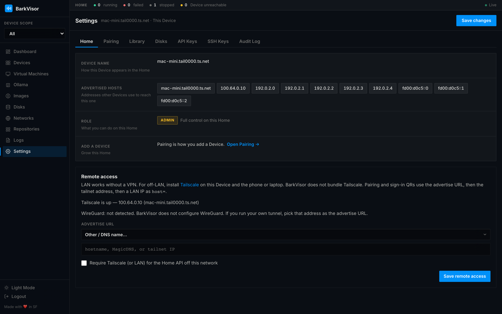

# Settings: Home

The **Home** tab is identity and reachability for this Device. It is not where pairing happens — the QR lives on [Pairing](settings-pairing.md).

## Facts sheet

- **Device name** — how this Device appears across the Home
- **Advertised hosts** — addresses other Devices use to reach this one
- **Role** — what your account can do on this Home
- **Add a {Device}** — shortcut into [Pairing](settings-pairing.md)

## Remote access

LAN works without any VPN. For off-LAN access, install [Tailscale](https://tailscale.com/download) on this Device and on your phone or laptop — BarkVisor does not bundle it. The card reports detection state:

- **Tailscale up** with its tailnet IP and MagicDNS name, or "not detected" with install hints
- **WireGuard**: whether a tunnel interface is present; BarkVisor never configures it, but you can advertise its address

Controls:

- **Advertise URL** — pick from detected hosts or enter a custom hostname, MagicDNS name, or tailnet IP
- **Require Tailscale (or LAN) for the Home API off this network** — tighten who can call the API from outside
- **Save remote access**

Pairing and sign-in QRs encode hosts in order: advertise URL first, then the tailnet address, then a LAN IP as `host=`.

## Save changes

The header button saves remote access and depot settings together.

## Related

- [Settings: Pairing](settings-pairing.md)
- [Settings: Library](settings-library.md)
- [Home and pairing](home-and-pairing.md)
