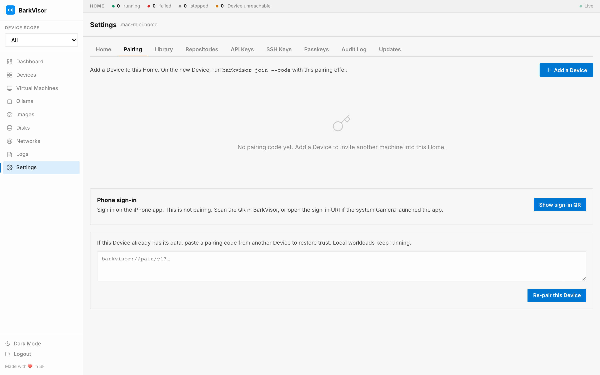

# Settings: Pairing

The **Pairing** tab issues the offers that grow the Home: adding another Device, and signing in from a phone.

## Add a Device

1. Click the primary add button — BarkVisor creates a pairing offer.
2. A short code appears with an expiry countdown, plus the full `barkvisor://pair/v1?…` offer to copy.
3. On the new Device, open setup and choose **Join an existing Home**, then paste the offer. From a shell on an API-only Device, `barkvisor-agent join --code '…'` (or `barkvisor join --code` on a full daemon) posts the same offer.
4. Revoke the code any time before it is used.

You can also pick which advertised host the offer should contain, including **Other / DNS name…** for custom addresses.

What joining does — and explicitly does not do — is covered in [Home and pairing](home-and-pairing.md).

## Phone sign-in

A second QR signs a phone's browser into this Home without typing the password. Scan it with the phone camera and confirm.

## Re-pair this Device

Regenerates this Device's own pairing material if it ever needs to rejoin.

## Related

- [Devices](using-devices.md)
- [Settings: Home](settings-home.md)
- [First launch](getting-started-first-launch.md)
