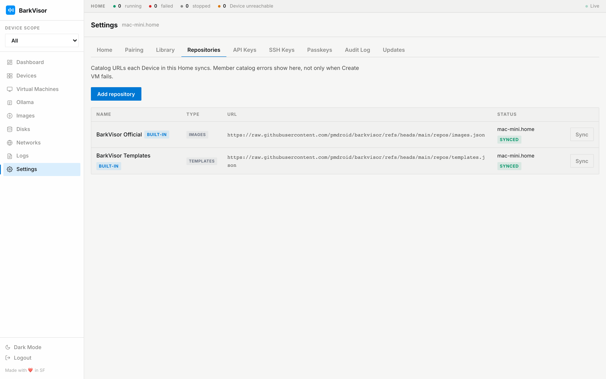

# Settings: Repositories

The **Repositories** tab lists catalog URLs each Device in this Home syncs. Templates and images from those catalogs show up in [Create VM](create-workload.md). Member catalog errors show on this page, not only when Create VM fails.

## Catalog URLs

Each row is a source:

- Name, type (`images` or `templates`), and the catalog URL
- Sync status per Device on built-in catalogs — idle, syncing, synced, or error, including `lastError`
- **Sync** pulls the catalog on Home and fans out to reachable members
- **Remove** on sources you added (built-in catalogs stay)

**Add repository** asks for the type and a catalog URL. That still lives on Home Settings, not on a member UI.

Built-in catalogs sync on startup. Use **Sync** when a catalog changed and you want it now.

## Related

- [Create a Workload](create-workload.md)
- [Images](using-images.md)
- [Settings: Library](settings-library.md)
