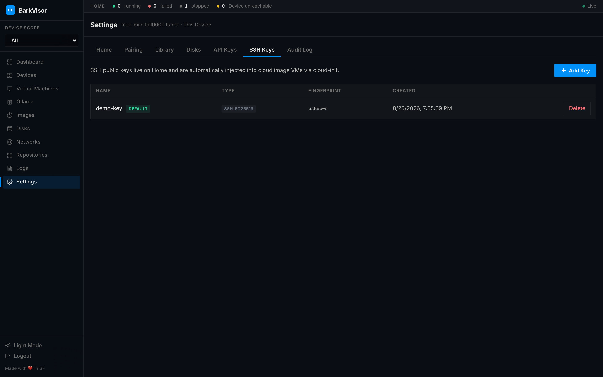

# Settings: SSH Keys

The **SSH Keys** tab stores public keys that get injected into guests, so you can `ssh` into Workloads without password games.

## Add a key

1. Click add.
2. Give it a **name** and paste the **public key** (the `ssh-ed25519 …`/`ssh-rsa …` line from your `~/.ssh/*.pub`).
3. Save — the key lands in the table.

## Managing keys

- **Set Default** — marks the key new Workloads receive
- **Delete** — removes it from the store; already-provisioned guests keep their copy until reprovisioned

For secret-less API access instead of shell access, use [API Keys](settings-api-keys.md).

## Related

- [Settings: API Keys](settings-api-keys.md)
- [Workload details](using-vm-details.md)
