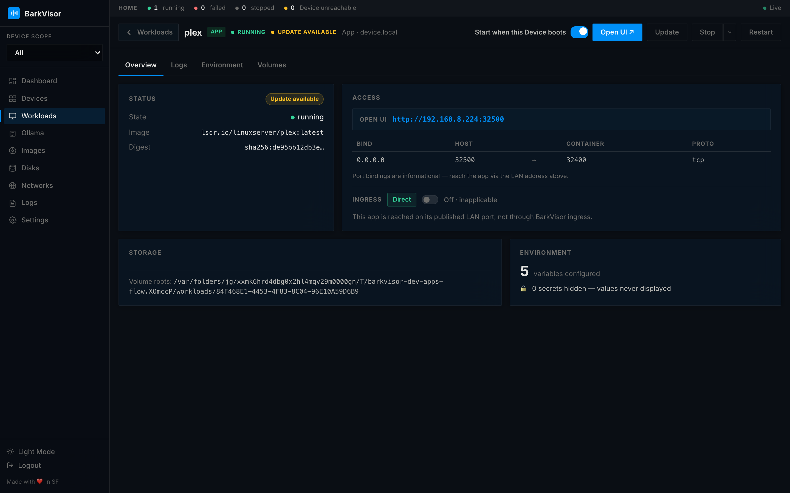
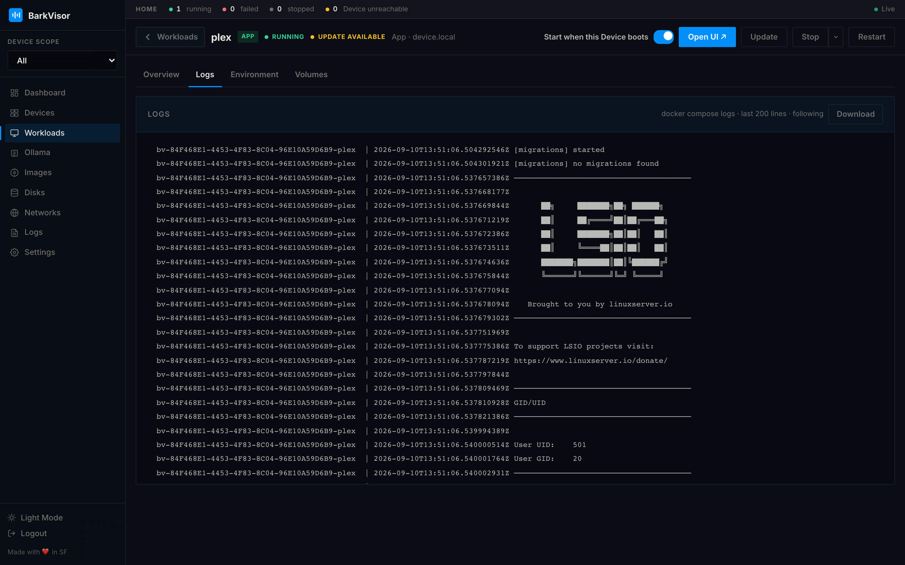
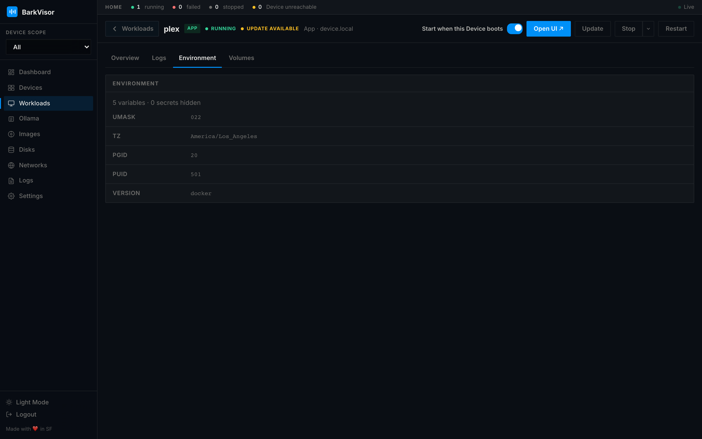
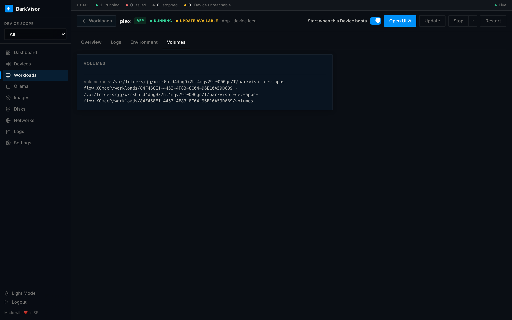

# Apps

**Workloads** lists VMs and **Apps** on the Devices in the current [scope](using-overview.md). An App is a Docker Compose project on a Device, not a guest VM.

The Device needs Docker Compose v2 (`docker compose version`). On a Mac that is OrbStack, Colima, or Docker Desktop. Device doctor warns if compose is missing; it does not fail the Device.

## Create App

From **Workloads**, click **Create App**. The magazine is **Gallery → Configure → Review**.

### Gallery

Cards come from two catalogs: **Big Bear Universal Apps** and **LinuxServer.io**. A card that the Device cannot run (architecture, or compose that BarkVisor will not apply) stays visible with Install disabled.

### Configure

Pick a **Device**. Fill the template: name, folders (FolderPicker for media), environment, secrets, and ports. LinuxServer images prefill **PUID**, **PGID**, and **TZ** from the Device. Secrets are stored in the Workload `.env` (mode 0600) and are not shown again in the UI.

**Create** applies the compose project. **Start** pulls the image and runs it.

Published ports listen on all interfaces. **Open UI** uses the Device LAN address, not a wildcard host.

## App details

Open the App row. Toolbar: **Stop**, **Restart**, **Open UI**, **Update** (when the catalog digest is newer), **Delete**.

Tabs: **Overview**, **Logs**, **Environment**, **Volumes**. There is no guest console, VNC, or ACPI shutdown — those are VM-only.

### Overview

Status (image, digest, **Update available**), Access (LAN Open UI, published ports, ingress Direct vs prefix), Storage, and an environment summary. Secrets stay hidden.

### Logs

Compose logs for this project. Some apps print a first-run password here (for example qBittorrent).

### Environment

Template variables. Secret keys show as dots.

### Volumes

Host binds and named volumes, plus the Workload volume root on the Device.

## Related

- [Create a Workload](create-workload.md) — VMs
- [Workload details](using-vm-details.md) — VM console and hardware
- [Logs](using-logs.md) — Home-wide log stream
