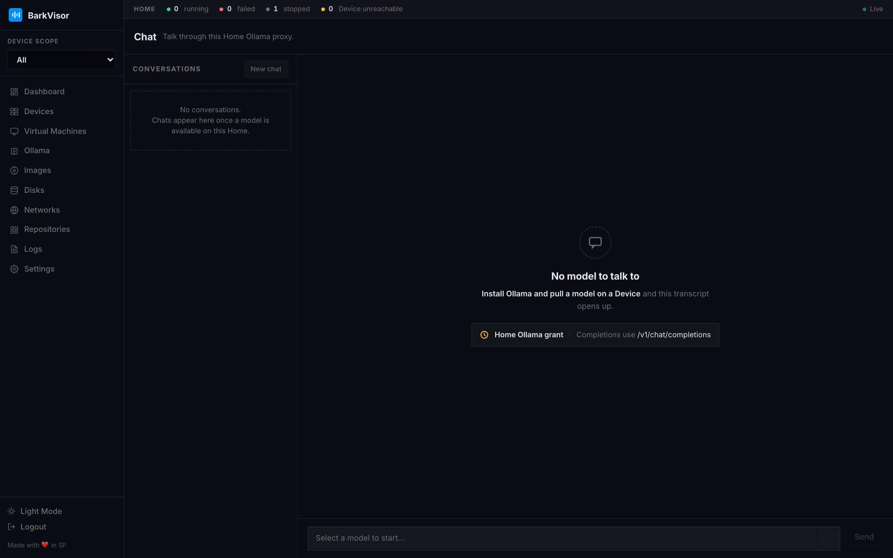

# Chat

**Chat** is the browser chat over your Home's Ollama models. The menu point only appears when at least one Ollama model is reachable — no reachable model, no tab.

## Layout

- **Conversations list** on the left, with **New chat**
- **Transcript panel** on the right

Pick a conversation to resume it; start a new one to open a fresh thread with a model.

## No model to talk to?

The empty state says so and links the fix: grant the Home access to Ollama and pull a model first — see [Ollama](using-ollama.md) and the [Ollama guide](ollama.md).

## Related

- [Ollama](using-ollama.md)
