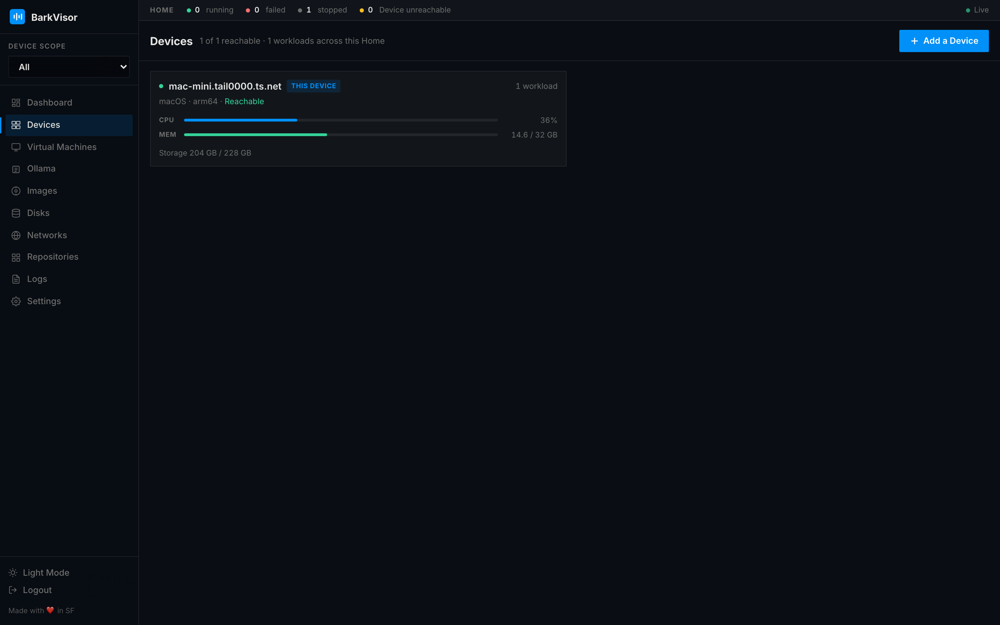

# Devices

A **Device** is a machine running the BarkVisor daemon — the Mac, PC, or board that hosts Workloads. The **Devices** page shows every machine in the **Home** and how it is doing.

## The grid

Each Device renders as a card with:

- Health dots for reachability and workload state
- Temperature and storage readings
- Reachability and workload totals in the header

Cards poll every 5 seconds, so state changes show up without a reload. Clicking a card opens the Device detail view.

## Adding a Device

**Add a {Device}** in the toolbar jumps to **Settings → Pairing**, where you issue the pairing offer. The flow is documented in [Home and pairing](home-and-pairing.md).

## Device detail

The detail page for one Device has:

- A **reachability pill** and a `platform · role` subtitle next to the name
- Stat cards **CPU**, **Memory**, and **GPU** with sparklines
- A **Facts** sheet — OS, Role, CPU, Memory, Storage, Temperature, Address, Uptime, Virtualization support, Agent version
- A **Workloads** table (Name, OS, CPU·Memory, Ports, Status) with per-row **Start / Stop / Restart** actions and a confirmation dialog before stopping
- A **failed-workload banner** with an inline **Start** button when something did not survive a reboot
- **Create VM** to place a new Workload directly on this Device

When a member Device is unreachable, its page still renders — controls that need the agent grey out instead of pretending.

## Related

- [Virtual Machines](using-vms.md)
- [Settings: Pairing](settings-pairing.md) — issue the pairing offer
- [Networks](using-networks.md) — how Devices reach each other
