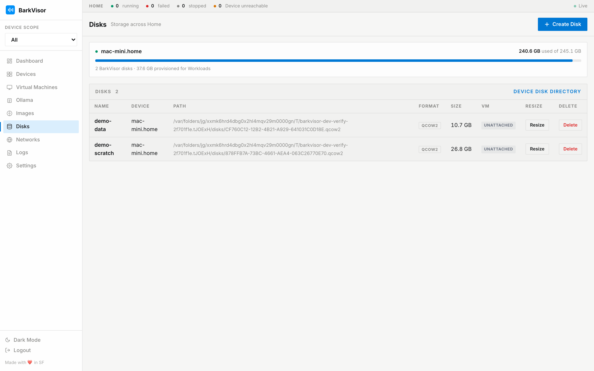

# Disks

**Disks** manages virtual disks across the Home — separate from boot images.

## Per-device usage

Storage cards show each Device's disk usage; unreachable Devices render as unreachable cards instead of fake numbers.

## Create Disk

**Create Disk** opens a modal ("Saved on this Device…") with:

- Name
- Block device (attach a host block device as raw; only offered when available)
- Size (GB)
- Format

Linux block-device notes:

- Mounts, swaps, and devices the host already uses stay blocked.
- The Device's `barkvisor` user needs the **disk** group (`barkvisor.service.d/disk.conf`).
- macOS has no block-device option.

## The table

| Column | Meaning |
|--------|---------|
| Name | Disk name |
| Device | Where it lives |
| Path | On-host path |
| Format | qcow2/raw |
| Size | Provisioned |
| Used | On-disk size (qcow2 sparse) with bar |
| VM | Attached Workload, if any |
| Resize | Grow in place |
| Delete | Remove after confirmation (hidden while a Workload uses the disk) |

New disks on a Device go to that Device's default disk directory unless Create Disk picks another folder — see the disk directory on the [Device](using-devices.md) page.

## Related

- [Devices](using-devices.md)
- [Workload details](using-vm-details.md)
