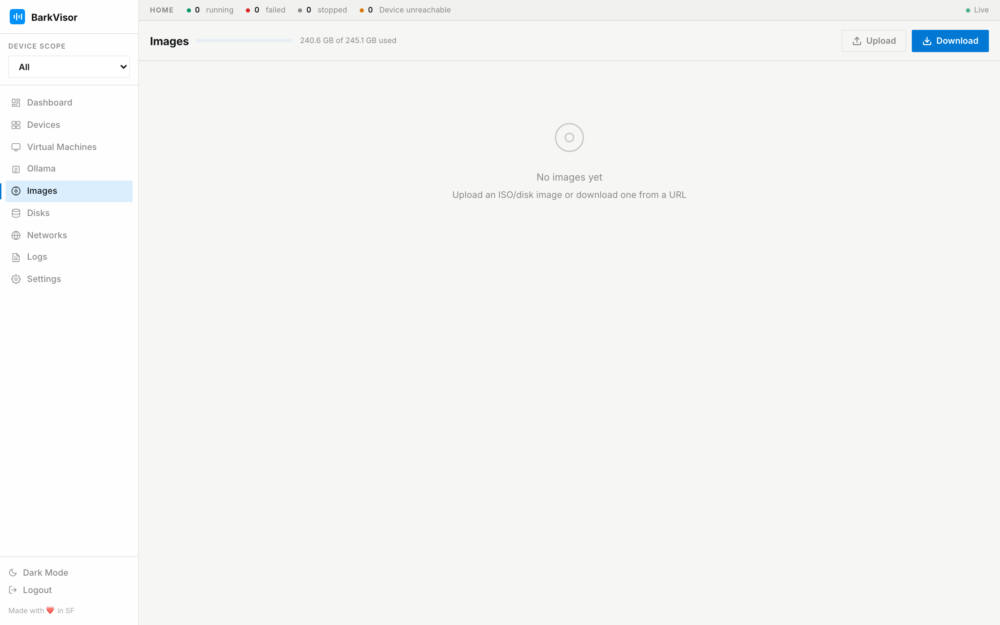

# Images

**Images** is the OS image library on this Device: ISOs and cloud images that [Create VM](create-workload.md) offers as boot media.

## Library capacity

The capacity bar shows used/free space for the Library path's volume. That volume can differ from the data directory; the same numbers appear under [Settings → Library](settings-library.md). Unknown capacity is not shown as zeros.

## Upload and download

- **Upload** opens a split-rail wizard modal: pick a file (or paste a URL), review name/arch, and confirm. Archives are decompressed automatically.
- **Download** pulls an image from a URL. Catalog images land through [Create VM](create-workload.md); catalog URLs live under [Settings → Repositories](settings-repositories.md).

Catalog downloads follow this Device's architecture by default; you can still download the other arch when it will deploy on a matching Device.

## The table

Name · Type · Arch · Size · Status, with a delete action per row. Deleting frees library space but breaks nothing that already booted from it.

## Related

- [Settings: Repositories](settings-repositories.md)
- [Settings: Library](settings-library.md)
- [Virtual Machines](using-vms.md)
