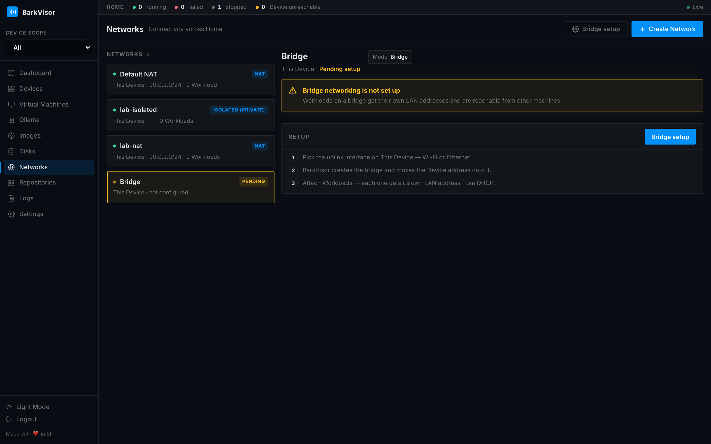

# Networks

**Networks** owns virtual networking for the Home: NAT, bridged, and isolated networks, plus host bridge setup. Networks live here — not in Settings.

## Toolbar

- **Bridge setup** — copyable host commands when the Device is not ready for bridged networks yet
- **Create Network** — opens the create modal

## The list

Networks render on the left. A Device that can do bridged networking but is not host-ready yet shows as amber **Bridge · Pending**. A Device that already has `br0` / `socket_vmnet` ready does not — create a Bridged network from **Create Network**.

## Inspect pane

Selecting a network shows:

- Mode chip (NAT / bridged / isolated)
- NAT subnet
- Attached Workloads
- Interfaces table

Selecting a pending bridge shows the host commands for that Device (Linux `br0` / macOS `socket_vmnet`) and **Re-check**.

## Create Network

The modal takes:

| Field | Meaning |
|-------|---------|
| Mode | **NAT**, **bridged**, or **isolated** |
| Bridge Interface | Host interface to bridge onto (bridged mode) |
| DNS Server | DNS handed to guests |

Attach networks to a Workload in its [Create VM](create-workload.md) wizard step or from [Workload details](using-vm-details.md).

## Related

- [Workload details](using-vm-details.md)
- [Devices](using-devices.md)
