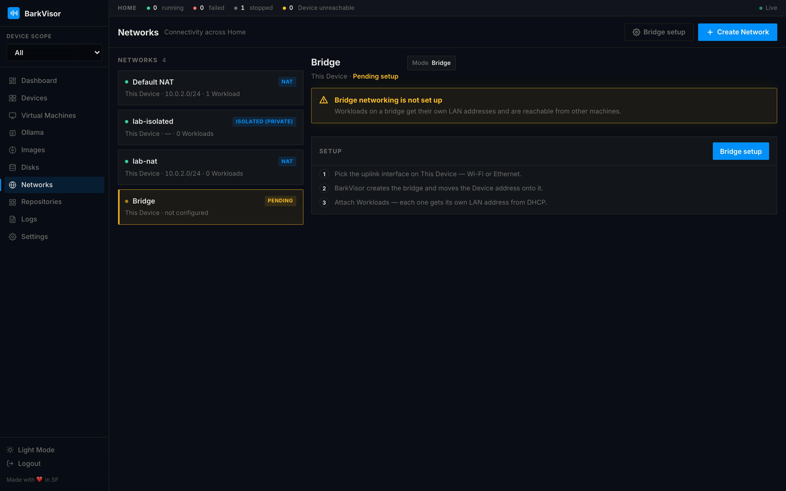

# Networks

Use **Networks** to manage the Device's network interfaces and the networks attached to VMs.



## Choose a VM network

| Mode | When to use it |
|------|----------------|
| **NAT** | A VM needs internet access without changing the Device's network. Publish individual guest ports to reach its services. |
| **Bridged** | A VM needs its own address on your LAN. Set up a bridge on the Device first. |
| **Isolated** | A VM should use an isolated network configuration. |

Windows Devices support NAT. Bridge management is available on macOS and Linux.

## Host interfaces

This tab lists network interfaces, their addresses, link state, bridge membership, and owning Device.

Select an interface to inspect or edit it. The DHCP address is read-only. You can add static addresses alongside it. Gateway and DNS settings apply to the interface, not to each additional address.

Click **Apply** to review the proposed changes before they take effect. After applying, click **Keep changes** within 60 seconds. Otherwise, BarkVisor rolls them back.

Changing an interface that carries your browser or SSH connection can interrupt that connection. Review the warning before applying.

## Create a bridge

1. Open **Host interfaces → Create → Bridge**.
2. Choose the Device and an unused network interface.
3. Keep the suggested bridge name, such as `br0`, or enter another.
4. Click **Apply**, review the changes, and confirm.
5. Click **Keep changes** within 60 seconds.

BarkVisor creates the bridge and a bridged VM network for it. You can then choose bridged networking when creating or editing a VM.

### Linux

Use a wired interface. Linux Wi-Fi interfaces and ifupdown-managed configurations are not supported by this flow.

BarkVisor configures the host bridge and QEMU bridge helper. Existing shared bridges are not deleted automatically.

### macOS

Install socket_vmnet with Homebrew as your regular user:

```sh
brew install socket_vmnet
```

The installed BarkVisor service starts socket_vmnet. You can use a supported LAN interface, including Wi-Fi. NAT VMs work without socket_vmnet.

## VM networks

The **VM networks** tab lists the network records VMs can use.

Click **Create Network**, choose a Device and mode, then fill in the available fields. For bridged mode, choose a bridge configured under **Host interfaces**. NAT and isolated networks offer a DNS server field. That value is the **guest-visible virtual nameserver** (QEMU's `dns=`), the address the guest queries — not the host's upstream resolver. Enter a dotted-quad IPv4 address such as `10.0.2.3`; leave it empty to use the emulator default.

A **Bridge · Pending** entry means the Device's bridge is not ready. Select it to open the relevant host interface. NAT remains available while bridge setup is incomplete.

Attach a network in **Create VM** or on the VM's [detail page](using-vm-details.md). For NAT services such as SSH, configure a port forward there. Restart a running VM after changing its port forwards.

## Port forward bind address

Each NAT port forward can name the Device address it is published on. **Leave the bind empty to publish on every IPv4 interface** — that is the default, and what a VM created before binds existed uses.

Set a bind when a port should be reachable only from one place on the Device. For example, to keep an SSH forward reachable from the Device itself without exposing it to the LAN:

```text
127.0.0.1:2222 → 22
```

The bind is shown read-only next to the other forwards on the VM's detail page. A VM with no bind renders exactly as before.

Widening a bind is deliberate. Clearing the box on a forward that already has a bind **keeps that bind**; to publish on every IPv4 interface instead, type `0.0.0.0`. A forward with no bind to begin with stays on every IPv4 interface.

Two forwards may share a host port as long as they use different binds. When you edit such a workload through **Edit**, each forward keeps its own bind because the console sends the bind it is showing you.

Applications publish their ports through their compose document, where the same idea is written as `host_ip` on the port mapping. The console's bound-ports editor edits that address too.

## Remove or revert changes

**Revert**, where offered, removes BarkVisor's host-network configuration. Linux bridges also offer **Delete**. You must remove workload references before deleting a bridge in use.

## Related

- [Create your first VM](getting-started-quickstart.md)
- [Devices](using-devices.md)
- [Troubleshooting](getting-started-troubleshooting.md)
