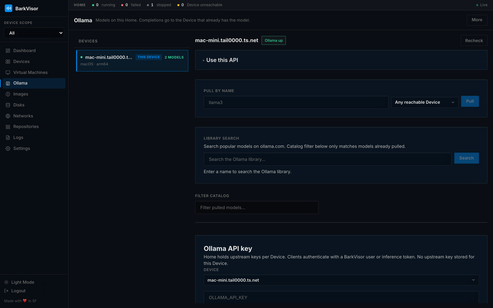

# Ollama

The **Ollama** page manages local model runtimes across the Home. It is visible to admins and to users with the **inference** role.

## Picking a Device

The left rail lists Devices with their Ollama reach state; **This Device** tags the machine you are browsing from. Selecting one scopes the inspect pane.

## Status and models

The right pane shows:

- A status chip with a **Recheck** button to re-detect the runtime now
- The model list on that Device, with pull management for adding more

For installing Ollama itself, pulling models, and how completions route through the Home, read the [Ollama guide](ollama.md).

## Completions

The inspect pane shows the Home completions URL (`/v1/chat/completions`). Inference keys live under Settings → API Keys.

## Export

Toolbar overflow menu → **More → Export JSON** dumps the current model inventory.

## Related

- [Settings: API Keys](settings-api-keys.md)
