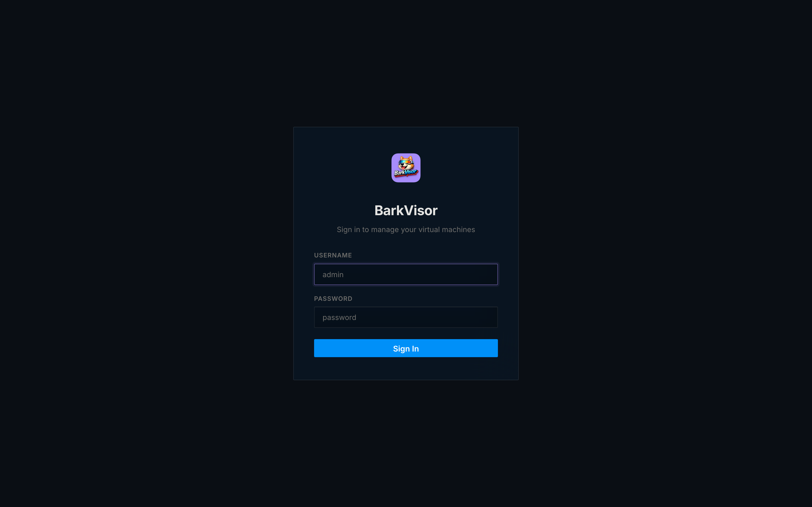

# Using the web UI

BarkVisor is a headless daemon that manages QEMU virtual machines and serves a web console. Install it on a **Device** ([macOS](getting-started-installation.md), [Linux](getting-started-linux.md)) and open `http://<device>:7777` in a browser — nothing to launch by hand; the daemon serves the UI itself. To hack on the UI or daemon, see [Development](getting-started-development.md).

Sign in with **Sign in with passkey** when the page is https (or localhost) on a hostname. Register more under [Settings → Passkeys](settings-passkeys.md). A raw IP (`127.0.0.1`) hides the button — use `localhost`.

## First run

Before sign-in, the setup wizard walks you through creating the **Home**:

- **Set up this Device** — add a passkey and pick the Library folder. This makes the machine the first Device of a new Home.
- **Join an existing Home** — paste or scan a pairing offer (`barkvisor://pair/v1?…`) issued by another Device in the Home.

Details live in [First launch](getting-started-first-launch.md) and [Home and pairing](home-and-pairing.md).

## Roles

- **Admin** — full access to every menu point described here.
- **Inference** — sees **Ollama** and lands there after sign-in. Everything else stays hidden.

## Reading the shell

Around every page sit four shared pieces of chrome:

- **Sidebar** — the navigation listed below. On small screens it collapses behind a hamburger button.
- **Device scope selector** — above the nav, "…scope" switches between **All** (the union of the Home) and one Device. List pages filter to that scope. Creating a VM keeps its own placement picker regardless.
- **Ops ticker** — the strip above the content shows live counts of running, failed, stopped, and unreachable Workloads/Devices, with a pulsing dot on problems and a **Live** marker on the right.
- **Bottom of the sidebar** — a **Light/Dark mode** toggle and **Logout**.

## Every menu point

| Menu | Page |
|------|------|
| Dashboard | [Dashboard](using-dashboard.md) |
| Devices | [Devices](using-devices.md) |
| Virtual Machines | [Virtual Machines](using-vms.md) and [Workload details](using-vm-details.md) |
| Ollama | [Ollama](using-ollama.md) |
| Images | [Images](using-images.md) |
| Disks | [Disks](using-disks.md) |
| Networks | [Networks](using-networks.md) |
| Logs | [Logs](using-logs.md) |
| Settings | [Settings](using-settings.md) — one page per tab |

## Related

- [Quickstart](getting-started-quickstart.md) — download an image, create your first VM
- [Product terminology](product-terminology.md) — Home, Device, Workload
- [Troubleshooting](getting-started-troubleshooting.md)
