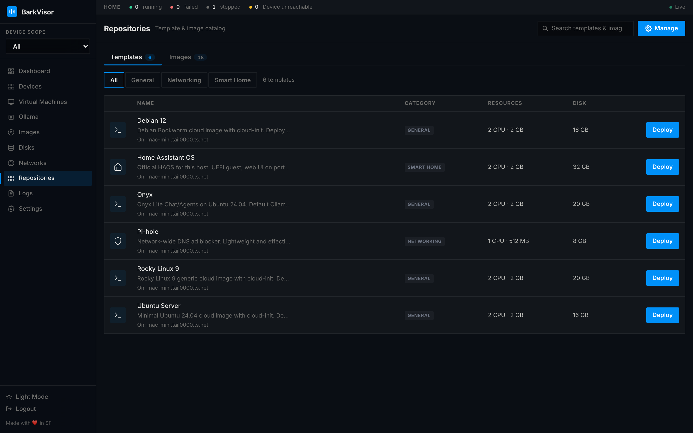

# Repositories

**Repositories** manages catalogs of templates and OS images you can sync into the [Library](using-images.md).

## Managing repositories

The toolbar has:

- A search box filtering what is already in your catalog
- **Manage** — dropdown listing each repository with type, built-in, and sync badges plus **Sync** and **Remove** actions, and **+ Add**

**+ Add** opens a modal asking for the repository **Type** and its **Catalog URL**.

## Catalog tabs

Two tables below:

- **Templates** — ready-made Workload definitions with a **Deploy** action that opens the template deploy wizard
- **Images** — catalog images with a **Download** action that fetches them into the Library

Downloads follow this Device's architecture by default (see [Images](using-images.md)).

## Empty state

With no repositories configured, the page shows the "Your catalog is empty" hero and zeroed stat cards — add a catalog URL to fill it.

## Related

- [Images](using-images.md)
- [Create a Workload](create-workload.md) — deploy from templates
