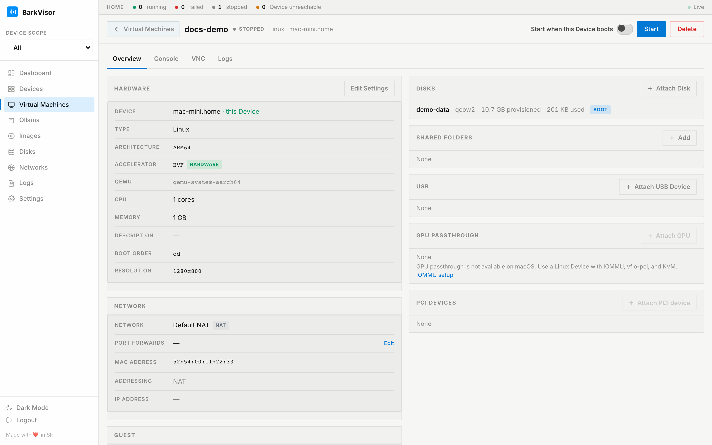

# Workload details

Every VM row links to its detail page. This is where you drive a single **Workload**: lifecycle actions, hardware facts, and the console surfaces.

## Toolbar actions

- **Start when this Device boots** — labeled toggle next to Start. Off unless you turn it on.
- **Start** — boot the Workload
- **Stop** — **Shutdown** (clean ACPI shutdown) vs **Force Stop** (pull the plug), with confirmation
- **Restart** — clean reboot
- **Delete** — removes the Workload after confirmation

Actions that need the Device's agent are disabled while it is unreachable.

## Tabs

Tabs are **Overview**, **Console**, **VNC**, and **Logs**. **Metrics** only shows while running. Which console tabs appear can depend on state and reachability.

### Overview

Read-only facts grouped into sections: **Hardware**, **Network**, **Guest**, **Disks**, **Shared folders**, **USB**, **GPU passthrough**, and **PCI devices**, each with its own attach/edit action (**Edit Settings**, **Attach Disk**, **Add**, **Attach USB Device**, **Attach GPU**, **Attach PCI device**).

### Console

A console in the browser (serial console, or **Terminal** for coding-agent Workloads).

### VNC

Graphical access via noVNC. The VNC view can be popped out into a dedicated resizable window (open VNC in a new resizable window) you can park on a second monitor.

### Metrics

Live CPU/memory charts — visible only for running Workloads.

### Logs

This Workload's log stream, filtered from the global [Logs](using-logs.md) feed.

## Related

- [Virtual Machines](using-vms.md)
- [Devices](using-devices.md)
- [Networks](using-networks.md) — ports and interfaces shown under Overview
- [GPU passthrough](getting-started-gpu-passthrough.md) — IOMMU / vfio-pci on a Linux Device
