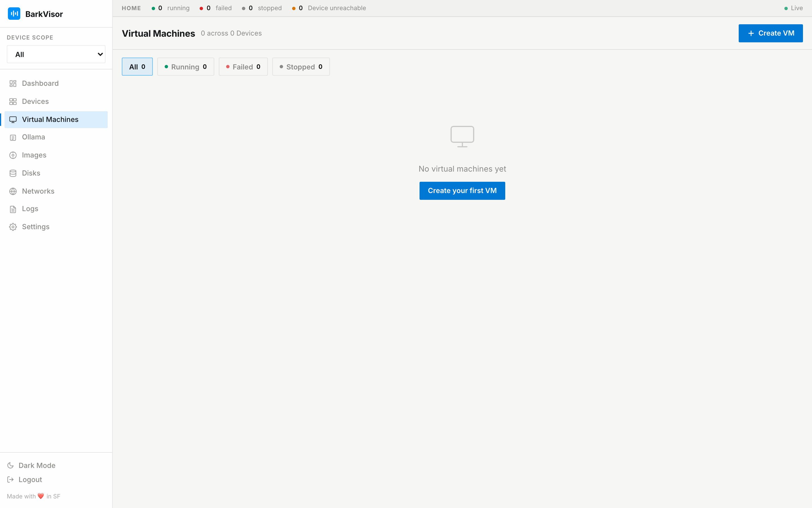

# Virtual Machines

**Virtual Machines** lists every **Workload** (VM) in the Home across all Devices in the current [scope](using-overview.md).

## Health filters

Filter chips above the table show counts at a glance:

- **All**
- **Running**
- **Failed**
- **Stopped**

The counts update live; a failed count above zero is your cue to visit the [Dashboard](using-dashboard.md).

## The table

| Column | Meaning |
|--------|---------|
| Name | Workload name — click to open [details](using-vm-details.md) |
| Device | Machine running it |
| OS | Guest OS / image it was created from |
| CPU · Mem | Allocated vCPUs and memory |
| Ports | Forwarded host ports |
| Status | Running, failed, or stopped |

## Create VM

**Create VM** opens the 3-step wizard (**Gallery → Configure → Disk**). The full walkthrough is in [Create a Workload](create-workload.md).

Empty Homes see "No virtual machines yet" with a **Create your first VM** button.

## Related

- [Workload details](using-vm-details.md)
- [Images](using-images.md) — pick what to boot
- [Disks](using-disks.md) — attach extra disks
